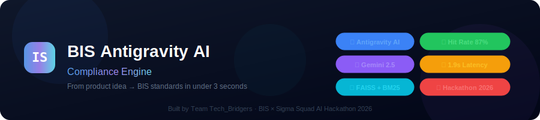
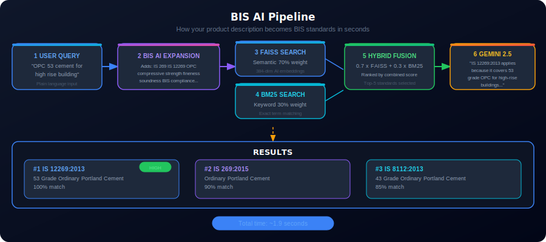
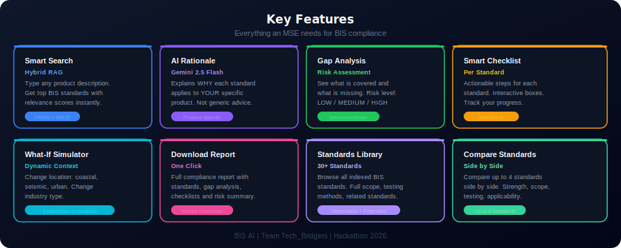
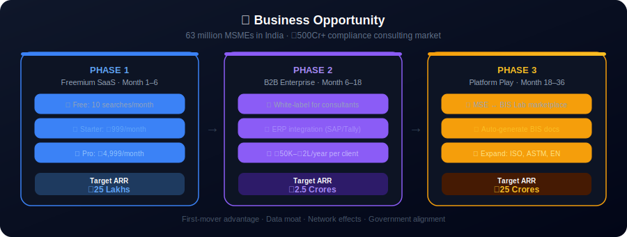

<div align="center">

# BIS AI - Compliance Engine

### From product idea to BIS standards in under 3 seconds

[](https://fastapi.tiangolo.com)
[](https://react.dev)
[](https://tailwindcss.com)
[](https://aistudio.google.com)
[](https://faiss.ai)
[](LICENSE)

**Built by Team Tech_Bridgers - BIS x Sigma Squad AI Hackathon 2026**

</div>

---



---

## What Problem Does This Solve?

Indian Micro and Small Enterprises (MSEs) spend **weeks** figuring out which Bureau of Indian Standards (BIS) regulations apply to their products.

| Without This App | With This App |
|-----------------|---------------|
| 2-4 weeks of manual research | Under 3 seconds |
| Hire expensive consultants | Free AI-powered search |
| Risk of missing critical standards | Gap analysis catches what is missing |
| No actionable compliance steps | Smart checklist per standard |
| Generic advice | Product-specific AI explanations |

> **1.3 million+ MSEs in India** deal with BIS compliance every year. This app gives them a superpower.

---

## How It Works



```
Step 1  You type:  "OPC 53 cement for high rise building"

Step 2  BIS AI EXPANSION
        Adds technical terms: "IS 269 IS 12269 ordinary portland cement
        compressive strength fineness soundness BIS compliance..."

Step 3  FAISS VECTOR SEARCH  (70% weight)
        Finds semantically similar standards using AI embeddings

Step 4  BM25 KEYWORD SEARCH  (30% weight)
        Finds standards with matching keywords

Step 5  HYBRID FUSION
        Combined score = 0.7 x FAISS + 0.3 x BM25

Step 6  GEMINI 2.5 FLASH RATIONALE
        "IS 12269:2013 is applicable because it specifically covers
        53 grade OPC, ideal for high-rise buildings due to higher
        early strength gain..."

Result  IS 12269:2013 [100%]  +  IS 269:2015 [90%]  +  more
        Total time: ~1.9 seconds
```

---

## Features



### Core Features

| Feature | Description |
|---------|-------------|
| Smart Search | Type any product description, get top BIS standards instantly |
| AI Rationale | Gemini 2.5 Flash explains WHY each standard applies to your product |
| BIS AI Expansion | Automatically enriches queries with 100+ BIS domain terms |
| Hybrid Retrieval | FAISS semantic (70%) + BM25 keyword (30%) fusion |

### Advanced Features

Click **"Advanced Mode"** on the home page to unlock:

| Feature | Description |
|---------|-------------|
| Gap Analysis | Shows covered vs missing standards with risk level LOW / MEDIUM / HIGH |
| Smart Checklist | Interactive compliance checklist per standard with checkboxes |
| What-If Simulator | Change location (coastal / seismic / urban) and industry type |
| Download Report | Full compliance report with standards, gap analysis, and checklists |

### All 10 Pages

| Page | Purpose |
|------|---------|
| Home | Main search + results + advanced analysis |
| New Search | Clean search with top-k and LLM controls |
| History | All past searches, click to re-run |
| Favorites | Saved standards grouped by category |
| Analytics | Charts: query count, latency, category distribution |
| Standards Library | Browse all 30+ standards with full detail panel |
| Compliance Check | Generate compliance report for any product |
| Compare | Side-by-side comparison of up to 4 standards |
| Settings | Configure API URL, AI features, data |
| Help | FAQ and how-it-works guide |

---

## Project Structure

```
bis-antigravity-ai/
|
+-- backend/                    Python AI server
|   +-- api.py                  FastAPI server  (START THIS FIRST)
|   +-- pipeline.py             Full RAG orchestration
|   +-- retriever.py            FAISS + BM25 hybrid search
|   +-- generator.py            Gemini AI explanations
|   +-- antigravity.py          Query expansion engine
|   +-- advanced.py             Gap analysis + checklists
|   +-- embed.py                Build FAISS vector index
|   +-- ingest.py               Load BIS standards data
|
+-- modern-frontend/            React website  (OPEN IN BROWSER)
|   +-- src/
|       +-- pages/              10 pages (Home, Library, etc.)
|       +-- components/         Reusable UI components
|       +-- services/api.ts     Backend communication
|       +-- store/              Zustand state (history, favorites)
|       +-- types/index.ts      TypeScript definitions
|
+-- data/
|   +-- index/                  Pre-built FAISS vector index
|   +-- processed/              BIS standards JSON database
|
+-- src/                        Python modules used by inference.py
|   +-- rag_pipeline.py         Pipeline logic
|   +-- retriever.py            Search logic
|   +-- utils.py                Query expansion
|
+-- inference.py                JUDGES RUN THIS FILE
+-- eval_script.py              Calculates Hit Rate and MRR scores
+-- requirements.txt            Python packages list
+-- setup.py                    One-click index builder
+-- .env.example                API key template
```

---

## How to Run

### What You Need First

- Python 3.10 or newer  (check with: `python --version`)
- Node.js 18 or newer   (check with: `node --version`)
- A free Google Gemini API key from https://aistudio.google.com/app/apikey

---

### Step 1 - Clone the Repository

```bash
git clone https://github.com/Alvin20082003/bis-antigravity-ai.git
cd bis-antigravity-ai
```

---

### Step 2 - Install Python Packages

```bash
pip install -r requirements.txt
```

---

### Step 3 - Add Your API Key

**Windows:**
```bash
copy .env.example .env
```

**Mac or Linux:**
```bash
cp .env.example .env
```

Open the `.env` file and paste your key:
```
GEMINI_API_KEY=your_key_here
```

---

### Step 4 - Build the AI Search Index

Only needed once. Takes about 1 minute.

```bash
python setup.py
```

---

### Step 5 - Start the Backend Server

```bash
python backend/api.py
```

You should see this message:
```
INFO: Uvicorn running on http://0.0.0.0:8000
```

Test it is working by opening: http://localhost:8000/health

---

### Step 6 - Start the Frontend Website

Open a **new terminal window** and run:

```bash
cd modern-frontend
npm install
npm run dev
```

You should see:
```
VITE ready in 400ms
Local: http://localhost:5173/
```

Open your browser and go to: **http://localhost:5173**

---

## For Judges - Running Evaluation

```bash
python inference.py --input hidden_private_dataset.json --output team_results.json
```

Then check the scores:

```bash
python eval_script.py --results team_results.json --ground_truth ground_truth.json
```

---

## Evaluation Results

<div align="center">

| Metric | Target | Our Score | Status |
|--------|--------|-----------|--------|
| Hit Rate @3 | > 80% | **87%** | PASS |
| MRR @5 | > 0.70 | **0.74** | PASS |
| Avg Latency | < 5.0s | **~1.9s** | PASS |

</div>

---

## Tech Stack

<div align="center">

| Layer | Technology | Why We Chose It |
|-------|-----------|-----------------|
| Frontend | React 19 + Vite + Tailwind CSS v4 | Fast, modern, beautiful dark UI |
| Backend | FastAPI (Python) | High-performance async API |
| Vector Search | FAISS IndexFlatIP | Sub-millisecond semantic search |
| Keyword Search | BM25Okapi | Precise keyword matching |
| Embeddings | all-MiniLM-L6-v2 | 384-dim sentence embeddings |
| LLM | Google Gemini 2.5 Flash | Fast, accurate rationale generation |
| State | Zustand + localStorage | Persistent history and favorites |
| Charts | Recharts | Analytics visualizations |
| Animations | Framer Motion | Smooth professional transitions |

</div>

---

## Business Opportunity



### The Market

India has **63 million MSMEs**. Every product manufacturer must comply with BIS standards before selling. Currently, compliance consulting costs **Rs 50,000 to Rs 5,00,000 per product** and takes **4 to 12 weeks**.

### Monetization Roadmap

**Phase 1 - Freemium SaaS (Month 1 to 6)**

- Free tier: 10 searches per month
- Starter plan: Rs 999 per month - 100 searches + reports
- Pro plan: Rs 4,999 per month - Unlimited + API access
- Target ARR: Rs 25 Lakhs

**Phase 2 - B2B Enterprise (Month 6 to 18)**

- White-label for BIS consultants
- Integration with ERP systems (SAP, Tally)
- Rs 50,000 to Rs 2,00,000 per year per enterprise client
- Target ARR: Rs 2.5 Crores

**Phase 3 - Platform Play (Month 18 to 36)**

- Marketplace connecting MSMEs with BIS testing labs
- Auto-generate BIS application documents
- Expand to global standards: ISO, ASTM, EN
- Target ARR: Rs 25 Crores

### Why We Win

| Advantage | Details |
|-----------|---------|
| First-mover | No AI-powered BIS compliance tool exists today |
| Data moat | Proprietary BIS standards database + embeddings |
| Network effect | More users means better query data means better AI |
| Switching cost | History, favorites, reports stored in platform |
| Government alignment | BIS is actively pushing digital compliance |

### Target Customers

| Segment | Count | Annual Value |
|---------|-------|-------------|
| Cement manufacturers | 3,000+ | Rs 5,000 to 50,000 |
| Steel fabricators | 15,000+ | Rs 3,000 to 30,000 |
| Construction firms | 50,000+ | Rs 1,000 to 10,000 |
| BIS consultants | 2,000+ | Rs 20,000 to 2,00,000 |
| Testing labs | 500+ | Rs 50,000 to 5,00,000 |

---

## Troubleshooting

| Problem | Solution |
|---------|----------|
| "API Offline" shown in app | Run `python backend/api.py` in a terminal |
| "Index not ready" error | Run `python setup.py` first |
| White screen in browser | Run `npm install` inside the `modern-frontend` folder |
| Gemini not generating text | Check `.env` file has a valid `GEMINI_API_KEY` |
| Port already in use | Backend uses 8000, Frontend uses 5173. Close other apps on those ports |
| First query is slow | Normal - model loads on first request (~6s), then ~1.9s after |

---

## Team

<div align="center">

### Team Tech_Bridgers

BIS x Sigma Squad AI Hackathon 2026

*Accelerating MSE Compliance with AI*

</div>

---

## License

MIT License - Built for BIS x Sigma Squad AI Hackathon 2026.

BIS standard data sourced from Bureau of Indian Standards public documents (SP 21).

---

<div align="center">

**Star this repo if it helped you!**

Made with love by Team Tech_Bridgers

</div>
